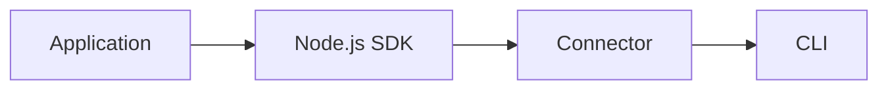

# ProbeX

ProbeX is an open-source runtime debugger for server applications.

It provides a simple way to inspect running applications through a lightweight SDK and connector, helping developers resolve testing and production issues with less effort.

> ⚠️ ProbeX is under active development. APIs and protocols may change before the first stable release.

---

## Why?

Debugging issues in running applications is often slow and expensive.

Developers frequently have to reproduce problems locally, add temporary logging, redeploy applications, or rely on environment-specific tooling. These workflows increase incident resolution time and make debugging more difficult.

ProbeX provides a consistent runtime debugging experience across environments.

---

## Features

- Runtime inspection
- Live data snapshots
- Lightweight Node.js SDK
- Headless architecture
- CLI for interacting with running applications
- Open connector protocol
- Extensible client architecture

---

## Architecture

The SDK exposes runtime information from a running application.

The connector provides a transport layer between the application and external clients.

The CLI is the first client implementation built on top of the connector protocol.

The connector protocol is open, allowing custom clients and integrations to be implemented independently.

---

## Components

### Node.js SDK

A lightweight SDK that integrates with your application and exposes runtime debugging capabilities.

### Connector

A transport layer that bridges the runtime and external clients.

### CLI

A command-line interface for interacting with running applications.

---

## Installation

### Server

> Documentation coming soon.

### CLI

> Documentation coming soon.

---

## Development

Instructions for setting up the repository locally will be added soon.

---

## Roadmap

Current focus:

- Node.js SDK
- Connector
- CLI

---

## Contributing

Contributions, issues, and feature requests are welcome.

---

## License

MIT
