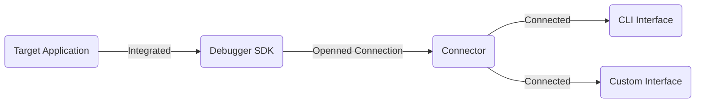
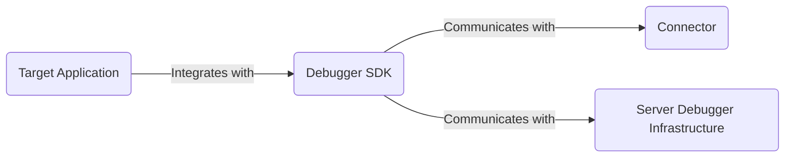
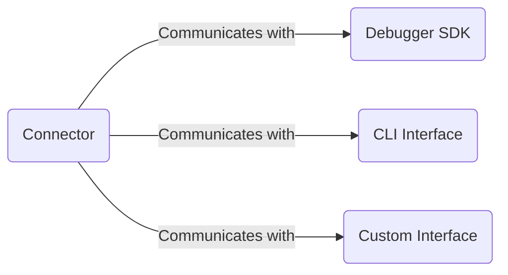
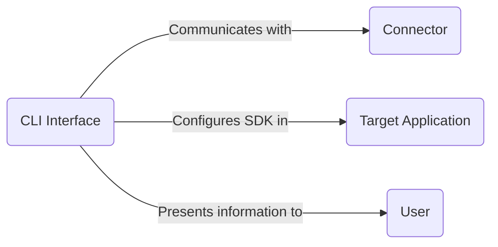
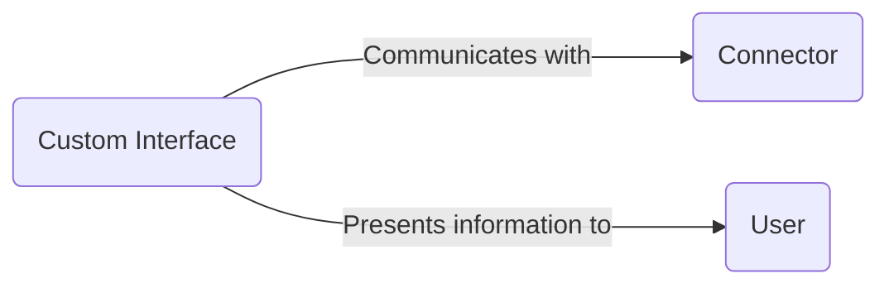
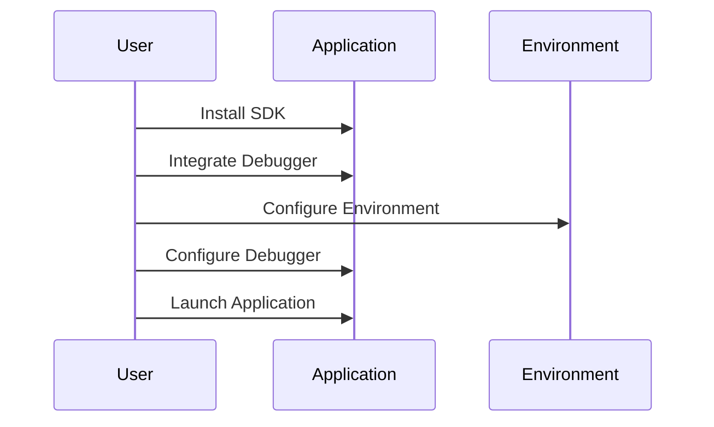
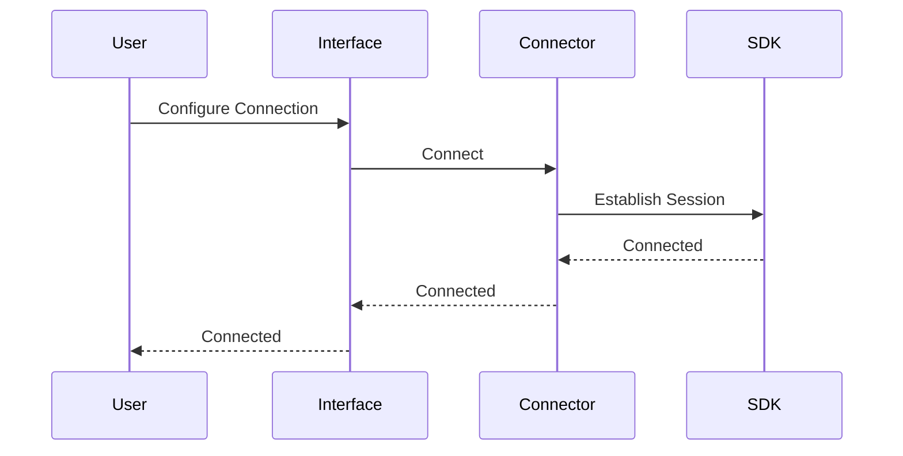
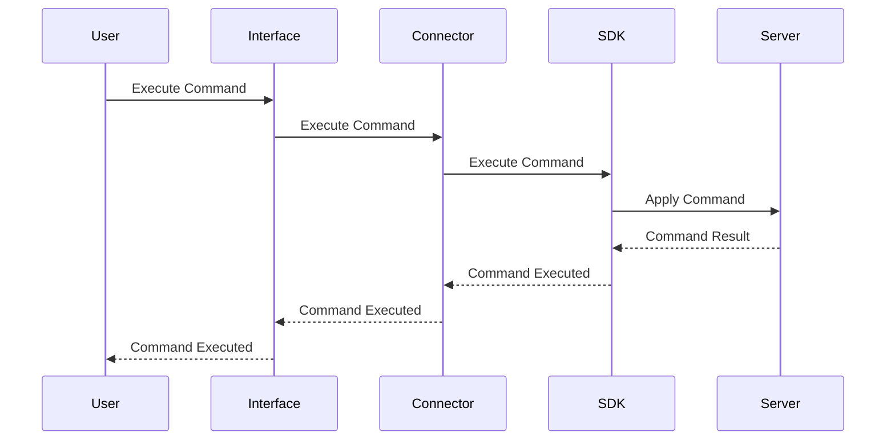
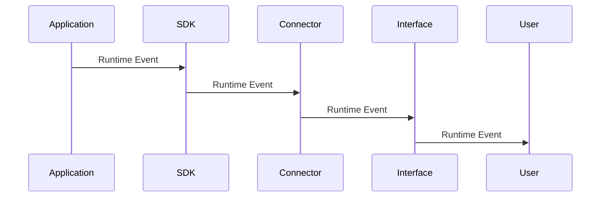

# ProbeX Architecture

This document describes the high-level architecture of ProbeX and the responsibilities of its core components.

## Diagram

## Components

### Target Application

Target Application is the server application that integrates the ProbeX debugger.

### SDK

SDK is the debugger SDK that provides the interface for the debugger to interact with the target application runtime.

### Connector

Connector is the component that establishes a connection between the debugger and the interfaces.

### CLI

CLI is the command-line interface that allows the user to interact with the debugger (Connecting, Managing Setup, Managing Migrations, etc.).

### Custom Interface

Custom Interface is the user managed interface that allows the user to interact with the debugger.

Possible interfaces:
- Custom CLI
- Web UI
- Prostman or similar
- Other WebSocket-based interfaces

## Relationships

### SDK

### Connector

### CLI

### Custom Interface

## Flows

`Interface`: this is  CLI or custom interface.

### Setup

### Connect Debugger

### Execute Command

### Runtime Event

